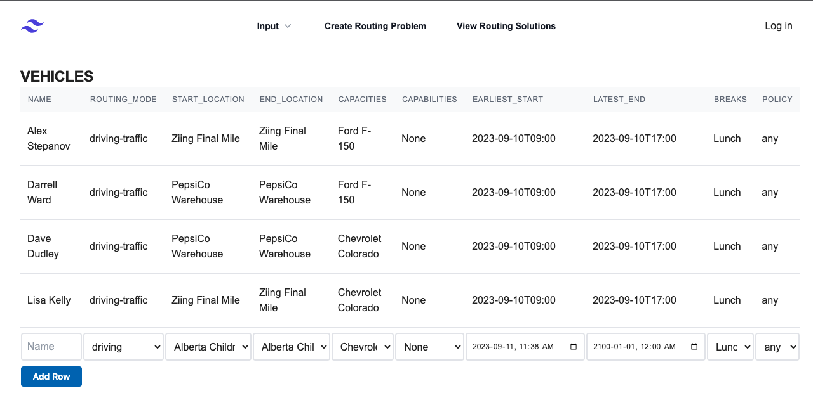
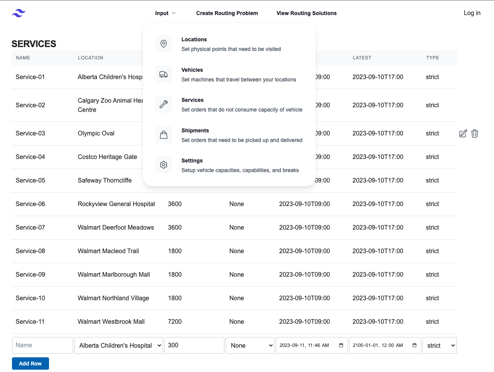
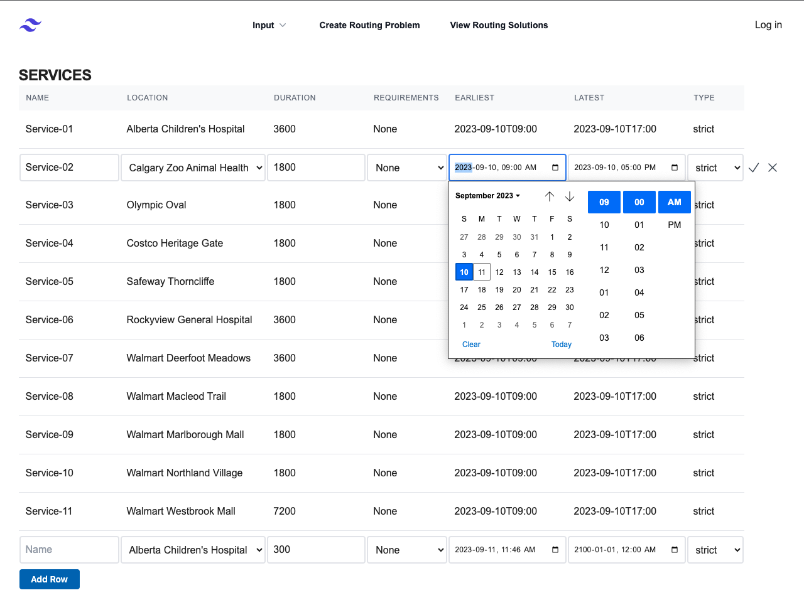
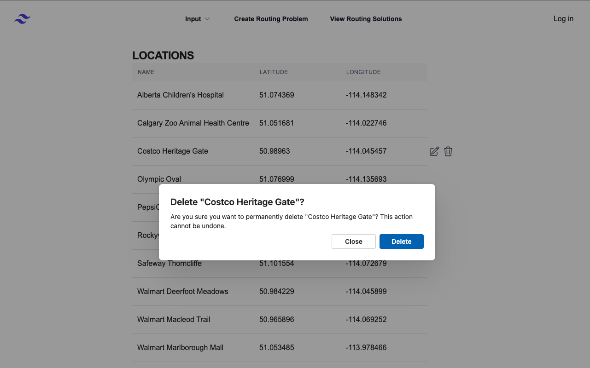
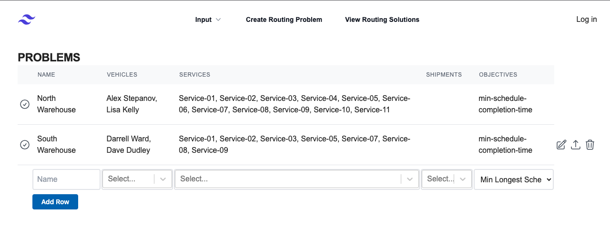
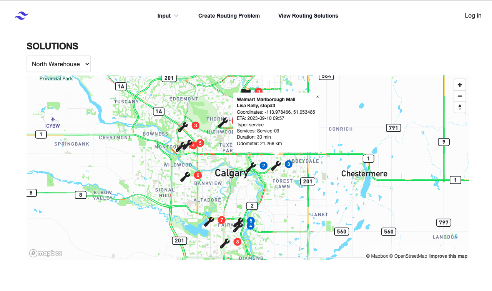

# Route Finder

"Route Finder" project is designed to help users submit routing problems to Mapbox.com via an API and then visualize the solutions on a map. The project can be very useful for various applications, such as route planning, navigation, logistics, or any scenario where you need to find optimal routes between locations.

## Screenshots
### Input -> Vehicles

### Input -> Services (Navigation Bar)

### Input -> Services (Edit Row)

### Input -> Locations (Delete Row)
  
### Create Routing Problem

### View Routing Solutions
  

(<a href="#readme-top">back to top)</a>

## Technologies Used

- JavaScript
- CSS
- MongoDB
- Mongoose
- Express
- Cors
- Morgan
- Dotenv
- Node.js
- REACT
- TailwindCSS
- Auth0
- FluentUI by Microsoft
- Heroicons
- Mapbox API and maps

(<a href="#readme-top">back to top</a>)

## Getting Started

[Click to see the app!](https://main--mapbox-route-finder.netlify.app/)

[Check out Trello sprint board](https://trello.com/invite/b/PcfGsH7j/ATTI7b7c87f894baa428babcfacad30713a0625CD735/route-finder)

[Click to see more in the planning.md](/lib/planning.md)

(<a href="#readme-top">back to top</a>)

<!-- ACKNOWLEDGMENTS -->
## Acknowledgments

* [Optimization API v2 documentation](https://docs.mapbox.com/api/navigation/optimization/)
* [Mapbox React Examples](https://github.com/mapbox/mapbox-react-examples) for building React apps with Mapbox GL JS

(<a href="#readme-top">back to top</a>)

<!-- LICENSE -->
## License

Distributed under the MIT License. See `LICENSE` for more information.

(<a href="#readme-top">back to top</a>)

## Ice Box

- Add Favicon to the app
- Implement client-side validation and alerts (e.g., for errors)
- Clearly indicate required fields and disallow optional fields
- Specify unitsin table headers for parameters (e.g., use seconds for breaks)
- Ensure that when deleting the last row in the app, the page does not freeze
- Explore other viable Mapbox APIs
- Conceal advanced settings on each page to reduce table size.
- Develop logic for deleting objects that are referenced in other tables.
- Enable multiple "capabilities", "breaks" and "submissions"
- Improve the styling of rows in edit mode.
- Design the homepage.
- Implement responsive design.
- Set up Google authentication keys for production and fix logout error.
- Handle error messages from Mapbox for problem submission and solution retrieval.
- Ensure that changing input triggers a problem processing restart.

## Report to Mapbox

- Breaks are returned for the year 1969.
- Shipments do not return any solutions.
- Understand the statuses of "Pending/OK" and "Processing/Complete."
- It doesn't work if the start and end locations are different.
- Only the min-schedule-completion-time works.

(<a href="#readme-top">back to top</a>)

