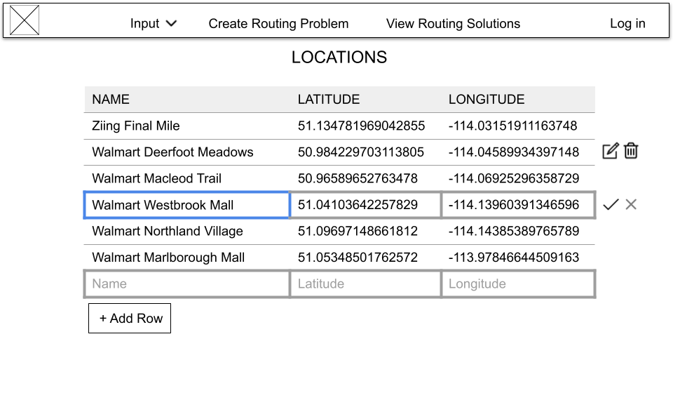
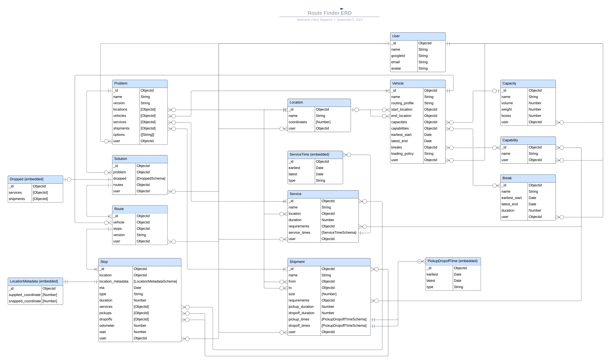

# Route Finder - Project 3 Planning

Done by Aleksandr (Alex) Stepanov

## Project Choice - Route Finder

"Route Finder" project is designed to help users submit routing problems to Mapbox.com via an API and then visualize the solutions on a map. The project can be very useful for various applications, such as route planning, navigation, logistics, or any scenario where you need to find optimal routes between locations.

## Wireframes

### Locations page

### Create Routing Problem Page

### View Routing Solutions Page

## Models/Schemas

### Primary Schema: RoutingProblem

| Property | Type | Validations | Default Value |
|----------|----------|----------|----------|

### Seconadary Schema: Location

| Property | Type | Validations | Default Value |
|----------|----------|----------|----------|

## Entity Relationship Diagram

[ERD on Lucid.app](https://lucid.app/lucidchart/cf946bce-6a36-486c-b658-4346058941cc/edit?invitationId=inv_fdc0247d-4a8b-4d90-98bd-5451d58dcc01)

## MVP CRUD / RESTful Routes
 Route name | CRUD operation | URL endpoint | Module name | Controller Action | Notes |
|----------|----------|----------|----------|----------|----------|

## JSON samples from Mapbox Optimization API v2

[Optimization API v2 documentation](https://docs.mapbox.com/api/navigation/optimization/)

## Component Tree

## Trello Sprint Board

Trello sprint board [link](https://trello.com/invite/b/PcfGsH7j/ATTI7b7c87f894baa428babcfacad30713a0625CD735/route-finder)

## User Stories

| US_ID__# | Short Name | Description | SP | Priority | Risk | Sprint | Dependant on US ID# |
|-------|------------|-------------|----|----------|------|--------|---------------------|
